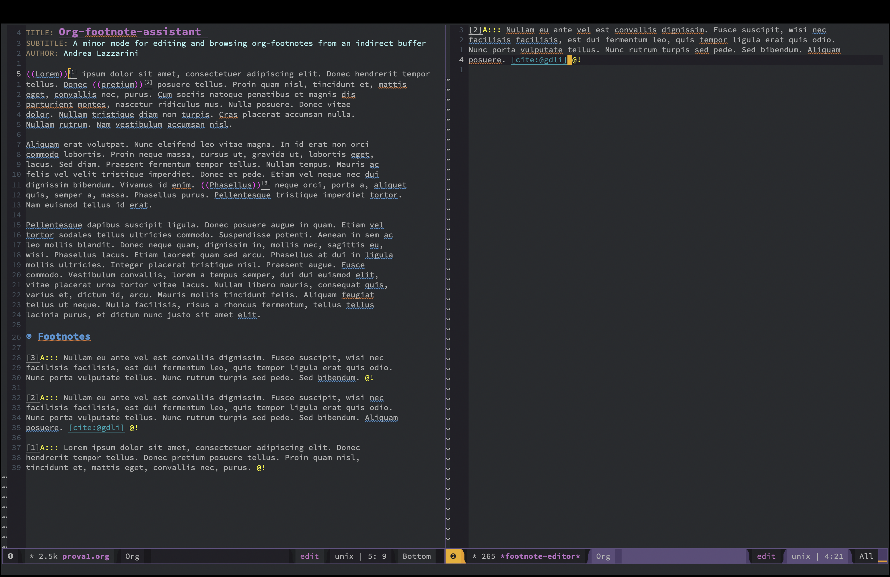

# Org-footnote-assistant

A minor mode for editing and browsing org-footnotes from an indirect buffer in a
side window.

## Introduction

The package **org-footnote-assistant** is designed to enhance the functionality
of footnotes in Org Mode. It provides additional features and keybindings to
assist in navigating, editing, and managing footnotes within an Org Mode buffer.

## Improved Footnote Viewing and Editing

This package might offer a solution to the limited inline viewing of Org Mode
footnotes, which can often hinder the reviewing and modification of content. In
Org Mode, the content of footnotes is not directly visible from the text, and
vice versa, making it harder to seamlessly review or modify the content.
Additionally, navigating between footnote references and their corresponding
content can be cumbersome, disrupting the flow of reading or writing. With
**org-footnote-assistant**, you can easily navigate between footnote references,
view their definitions in an editable buffer, and streamline your workflow when
working with footnotes in Org Mode.

## Functionality

The package defines a minor mode called `org-footnote-assistant-mode` that can
be toggled on or off. When activated, it adds several keybindings to the Org
Mode keymap to facilitate working with footnotes.

Here is an overview of the functionality provided by **org-footnote-assistant**:

1. **Navigation:** The package allows you to quickly navigate between footnote
   references in an Org Mode buffer. The keybinding `C-c C-n`
   (`org-footnote-assistant-goto-next-footnote`) moves the cursor to the next
   footnote reference in the buffer, while `C-c C-p`
   (`org-footnote-assistant-goto-previous-footnote`) moves to the previous
   footnote reference.

2. **Definition Display:** The command `org-footnote-assistant--show-definition`
   narrows the buffer to the region of the current footnote definition if the
   cursor is positioned at a footnote reference. It retrieves the label of the
   current footnote and uses it to determine the corresponding definition's
   location. The narrowed buffer with the footnote definition is displayed in a
   separate window.

3. **Footnote Editing Window:** The function
   `org-footnote-assistant--create-editor-window` is responsible for creating
   and managing the "*footnote-editor*" buffer, which displays the narrowed
   region containing the footnote definition. If the "*footnote-editor*" buffer
   already exists and is related to the current buffer, it narrows the buffer to
   the new definition region and displays it. If the buffer exists but is not
   related to the current buffer, it is killed and a new indirect buffer is
   created. If the buffer does not exist, a new indirect buffer is created.

4. **Customized Footnote Definition Jumping:** The package overrides the default
   behavior of `org-footnote-goto--definition` with the modified function
   `org-footnote-assistant--goto-definition`. This function integrates with
   `org-footnote-assistant--create-editor-window` to jump to the definition of a
   specified footnote label. It narrows the buffer to the definition region and
   positions the cursor at the appropriate location.

5. **Enhanced Footnote Reference Searching:** The package also modifies the
   behavior of `org-footnote-goto-previous-reference` by advising the function
   with `org-goto-previous-reference-advice`. This advice ensures that if the
   current buffer is the "*footnote-editor*" buffer, the focus is switched to
   the base buffer where the original footnote reference was found.

6. **Eeasier Footnote Deletion:** To delete a footnote, you can use the
   `org-footnote-assistant-delete-footnote` function. By default, this function
   prompts for confirmation before deleting the footnote. However, you can
   customize this behavior by setting the variable
   `org-footnote-assistant-ask-before-delete` to nil in your Emacs configuration
   file.

In summary, "org-footnote-assistant" provides convenient keybindings for
navigating between footnote references, displaying the definitions in an
editable buffer, and customizing the behavior of footnote definition jumping. It
enhances the overall experience of working with footnotes in Org Mode by
simplifying navigation and providing a dedicated editing environment for
footnote definitions.

## Feedback and Collaboration

This is my first Org Mode package, and I am eager to receive feedback and
external input from the community. I encourage you to try out the package, test
its functionality, and explore how it can improve your experience working with
footnotes in Org Mode.

Your feedback is valuable in enhancing and extending the functionality of the
code. If you have ideas for additional features or improvements, I am open to
suggestions. Together, we can make this package more robust and user-friendly.

